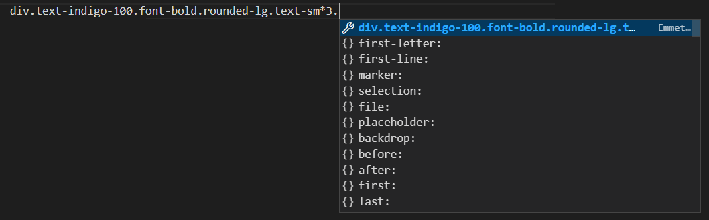

# Coindashboard-frontend

ReactJS based web UI for Coindashboard SIP project.

## Setup environment

### Node.js

Install Node.js from [official website](https://nodejs.org/en/), choose version **16.16.0LTS**,
install using defaults.

Verify using command:

```bash
> node -v
v16.16.0
```

### Clone the repository

```bash
> git clone https://github.com/CuttingEdgeCommunity/coindashboard-frontend
```

### Install dependencies

```bash
> cd coindashboard-frontend
> npm install

```

### Install dependencies for developpment purposes

```bash
> cd coindashboard-frontend
> npm install json-server

```

### run The local JSON server and the react Application

```bash
> json-server --watch db.json --port 3001
> npm run start
```

## Editor setup (VS Code)

Download extensions:

- Tailwind CSS IntelliSense
- Tailwind Docs

In order to get tailwind specific autocomplete, do not use tab or enter completion before list of tailwind classes suggestions pops up

### Not working:

(See the light highlight - you do **not** want this)


### Working:


## Emmet code generation

Emmet allows to generate markups using css selector like syntax. To set it up, You need to include following settings to your editor's `settings.json` file. To acces it go to: <kbd>CTRL+SHIFT+P</kbd> > Open Settings (JSON)

```json
{
  "tailwindCSS.emmetCompletions": true,
  "emmet.includeLanguages": { "javascript": "javascriptreact" }
}
```

To generate code specify an element, and chain classes using dot operator. You can chain multiple classes, as well as use quantity specifiers.

Once You finished, press <kbd>TAB</kbd> to generate.



### Result:


## Automatic tailwind classes sorting

Install `Headwind` VS Code plugin and formatting will occur automaticly on file save.

## Technologies

- Node.js
- React
- Tailwind CSS
- **TODO**: add other technologies as needed (eg. test frameworks, ui kits)

## About Tailwind CSS

### Resources

**Warning** do **not** use "tailwindui" as it's not free!

- [Example: Rebuilding Coinbase with Tailwind CSS](https://www.youtube.com/watch?v=7gX_ApBeSpQ)
- [Free ui kits repository](https://www.tailwindawesome.com/?price=free), always remember to check license! Make sure it's **MIT**.
- [Install Tailwind with React](https://tailwindcss.com/docs/guides/create-react-app)
- [Tailwind's creator YT channel](https://www.youtube.com/c/TailwindLabs/about)
- [Tailwind CSS v2.0: From Zero to Production playlist](https://youtube.com/playlist?list=PL5f_mz_zU5eXWYDXHUDOLBE0scnuJofO0)

### Example UI Kits

- [Kometa UI](https://kitwind.io/products/kometa/)
- [Kutty](https://kutty.netlify.app/)
- [Flowbite](https://flowbite.com/)
- [Preline](https://preline.co/index.html)
- [Hyper UI](https://www.hyperui.dev/)
- [Tailblocks](https://tailblocks.cc/)
- [Meraki UI](https://merakiui.com/components/)
- [Tailwind Kit](https://www.tailwind-kit.com/)

## How to use components

When adding new component or library, add it to the [used technologies](#technologies) section with it's license (again, it should be MIT). License often can be found on Github repo or in footer/header/about sections of project's website.

### HTML

First, convert HTML to JSX. You can use a online converter, for exampe [Click](https://transform.tools/html-to-jsx) or use "Html to JSX" VS Code plugin. Then create new file for the component and wrap it into class or function like you would do with your own HTML. For additional safety you can wrap the whole code in `<> ... </>` if there isn't one root element in the kit's code. **Do not paste it in inside long markup** as it would drastically reduce code readibility. Always create new component in a separate file.

### React

As components are already created, you only need to add the library to dependencies using `npm install` command. Sometimes you will need add a plugin in the `tailwind.config.js` file. Always follow specific documentation. Examples: [HeadlessUI](https://github.com/tailwindlabs/headlessui) and [Flowbite-react](https://flowbite-react.com/).
